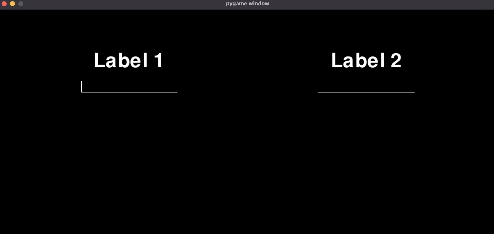

# Text input
Ready to go, plug-and-play, easy module for handling text input in pygame.

### Example use cases
- Reading a username 
- Simple chat implementation

### To do:
- [ ] implement this using OOP for easier use and better code quality
- [ ] make the build modular i.e. cursor could be a separate class that registers a timer on object creation
- [ ] fix bug with non ASCII symbol showing up in the 2nd input on tab/enter-ing from the 1st input
- [ ] try to handle SHIFT+TAB combination by reading unicode codes

### Preview
